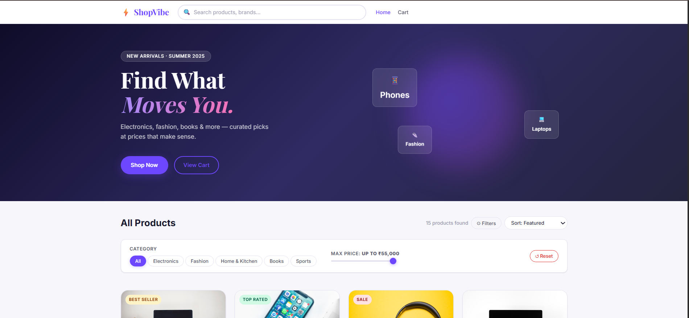
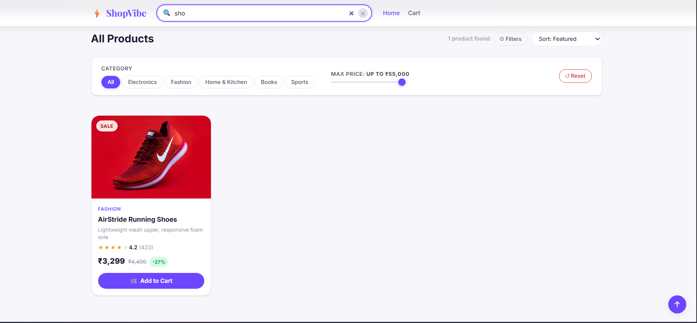
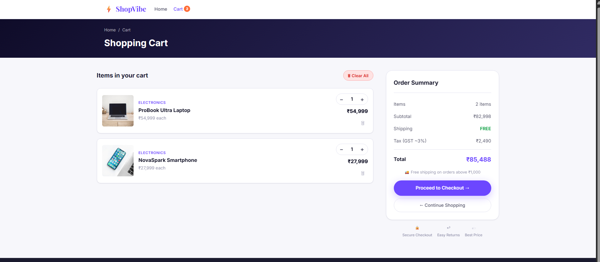
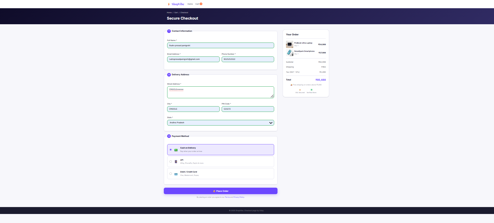
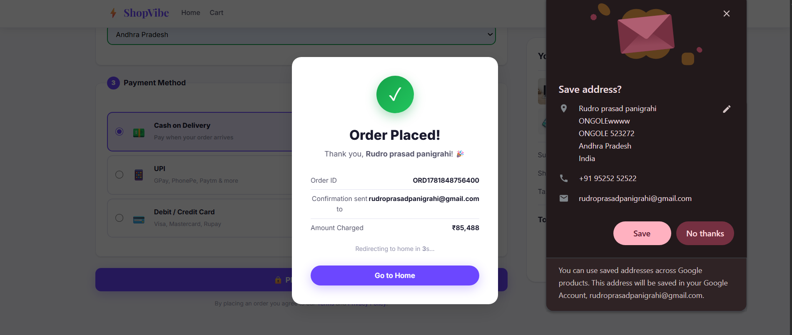

# 🛍️ ShopVibe - Modern E-Commerce Frontend

<p align="center">


</p>

<p align="center">
A Modern, Responsive and Interactive E-Commerce Frontend Website built using HTML, CSS and JavaScript.
</p>

---

# 📖 Project Description

ShopVibe is a modern frontend-only e-commerce web application designed to provide users with a seamless online shopping experience.

The platform allows users to browse products, search products instantly, apply category and price filters, manage shopping carts, and complete the checkout process through a modern and responsive user interface.

The project was developed to simulate a real-world e-commerce application while focusing on frontend architecture, DOM manipulation, LocalStorage management, responsive design, and collaborative software development practices.

### 🎯 Target Users

* Online shoppers
* Students learning frontend development
* Recruiters reviewing portfolio projects
* Internship evaluators
* Academic project reviewers

### 🎯 Key Objectives

* Build a responsive shopping experience
* Demonstrate modern frontend development practices
* Implement cart and checkout functionality
* Practice GitHub collaboration workflow
* Simulate real-world e-commerce behavior

---

# 🏢 Internship Project

This project was developed as part of the **AI Full Stack Development Internship Program** conducted by **Sraventix Technologies LLP (TechVerza)**.

The project was assigned as a collaborative team project to help interns gain practical experience in:

* Frontend Development
* Team Collaboration
* GitHub Workflow
* Branch Management
* Software Development Life Cycle
* UI/UX Design
* E-Commerce Application Development

### Organization

**Sraventix Technologies LLP (TechVerza)**

### Internship Domain

AI Full Stack Development

### Project Type

Frontend E-Commerce Web Application

### Development Model

Team-Based Agile Development

---

# 🚀 Features

## Product Management

* Product Listing
* Product Cards
* Product Search
* Category Filtering
* Price Filtering
* Product Sorting
* Dynamic Product Rendering

## Shopping Cart

* Add To Cart
* Remove From Cart
* Quantity Management
* Cart Summary
* Dynamic Total Calculation
* LocalStorage Persistence

## Checkout System

* Customer Information Form
* Address Management
* Payment Method Selection
* Order Summary
* Form Validation
* Order Success Popup

## User Experience

* Fully Responsive Design
* Modern UI Components
* Interactive Product Cards
* Smooth Animations
* Mobile Friendly Layout
* Fast User Interaction

---

# 🏗️ Project Architecture

## Frontend Architecture

```text
User
 │
 ▼
index.html
 │
 ▼
display.js
 │
 ├── search.js
 ├── filter.js
 │
 ▼
cart.js
 │
 ▼
checkout.js
 │
 ▼
LocalStorage
```

### Components

| Layer        | Description                      |
| ------------ | -------------------------------- |
| HTML         | Structure of the application     |
| CSS          | Styling and responsiveness       |
| JavaScript   | Business logic and interactivity |
| LocalStorage | Client-side data persistence     |

### Deployment

* GitHub Pages
* Netlify
* Vercel
* Local Browser

---

# 📂 Project Structure

```text
ecommerce-frontend/

├── index.html
├── cart.html
├── checkout.html

├── css/
│   ├── style.css
│   ├── cart.css
│   ├── checkout.css
│   └── responsive.css

├── js/
│   ├── products.js
│   ├── display.js
│   ├── search.js
│   ├── filter.js
│   ├── cart.js
│   ├── checkout.js
│   └── utils.js

├── assets/
│   ├── images/
│   └── icons/

├── screenshots/

├── README.md

└── .gitignore
```

## Folder Explanation

| Folder/File   | Purpose                                |
| ------------- | -------------------------------------- |
| index.html    | Homepage and Product Listing           |
| cart.html     | Shopping Cart Page                     |
| checkout.html | Checkout Page                          |
| products.js   | Product Data Source                    |
| display.js    | Product Display Logic                  |
| search.js     | Search Functionality                   |
| filter.js     | Category & Price Filters               |
| cart.js       | Cart Management                        |
| checkout.js   | Checkout Validation & Order Processing |
| assets/       | Images and Icons                       |
| screenshots/  | README Images                          |

---

# 👨‍💻 Team Structure

## Team Members

| Team Member            | Role                               | Responsibilities                                                         |
| ---------------------- | ---------------------------------- | ------------------------------------------------------------------------ |
| Rudro Prasad Panigrahi | Team Leader & Integration Engineer | Project Planning, GitHub Management, Integration, Testing, Documentation |
| Kiran                  | Frontend UI Developer              | Homepage Design, Product Cards, Responsive UI                            |
| Pramod                 | Search & Filter Developer          | Search, Category Filter, Price Filter, Sorting                           |
| Sathwik                | Cart Management Developer          | Add To Cart, Cart Logic, Quantity Management                             |
| Uday                   | Checkout Developer                 | Checkout Form, Validation, Order Summary                                 |

---

# 🔄 Development Workflow

## Step 1: Requirement Analysis

* Analyze project requirements
* Define application scope
* Identify features
* Allocate responsibilities

## Step 2: Branch Strategy

```text
main

├── rudro-integration
├── kiran-product-listing
├── pramod-search-filter
├── sathwik-cart
└── uday-checkout
```

### Git Workflow

1. Create Branch
2. Develop Feature
3. Commit Changes
4. Push Branch
5. Create Pull Request
6. Review Code
7. Merge to Main

## Step 3: Development Process

### Daily Development

* Build assigned module
* Commit regularly
* Push updates
* Submit Pull Request

### Code Review

* Review by Team Leader
* Bug Identification
* Improvement Suggestions
* Final Approval

### Integration

* Merge modules
* Resolve conflicts
* Perform testing

---

# 🛠️ Technology Stack

## Frontend

* HTML5
* CSS3
* JavaScript (ES6)

## Storage

* Browser LocalStorage

## Development Tools

* Git
* GitHub
* VS Code
* Chrome DevTools

---

# ⚙️ Installation Guide

## Clone Repository

```bash
git clone <repository-url>

cd ecommerce-frontend
```

## Run Application

### Option 1

Open:

```text
index.html
```

directly in browser.

### Option 2 (Recommended)

Install VS Code Live Server Extension.

Right Click:

```text
index.html
```

Select:

```text
Open With Live Server
```

---

# 📸 Project Screenshots

## 🏠 Home Page

```markdown

```

## 🔍 Product Search & Filter

```markdown

```

## 🛒 Shopping Cart

```markdown

```

## 💳 Checkout Page

```markdown

```

## ✅ Order Success Popup

```markdown

```

---

# 🎯 Future Enhancements

* Payment Gateway Integration
* Product Wishlist
* User Authentication
* Dark Mode
* Product Reviews
* AI Product Recommendation Engine
* Progressive Web App (PWA)
* Mobile Application

---

# 🧪 Testing

## Functional Testing

* Product Listing
* Search Functionality
* Category Filtering
* Cart Operations
* Checkout Process

## Responsive Testing

* Desktop
* Laptop
* Tablet
* Mobile

## Browser Compatibility

* Chrome
* Firefox
* Edge

## Manual Testing

* End-to-End User Flow
* Cart Validation
* Checkout Validation

---

# 📈 Project Status

| Module               | Status      |
| -------------------- | ----------- |
| Product Listing      | ✅ Completed |
| Search Functionality | ✅ Completed |
| Filter System        | ✅ Completed |
| Cart Management      | ✅ Completed |
| Checkout Process     | ✅ Completed |
| Responsive Design    | ✅ Completed |
| Testing              | ✅ Completed |
| Documentation        | ✅ Completed |

### Progress

```text
████████████████████ 100%
```

Project Completion: **100%**

---

# 🤝 Contribution Guidelines

1. Fork Repository

2. Create Branch

```bash
git checkout -b feature-name
```

3. Commit Changes

```bash
git commit -m "Added new feature"
```

4. Push Branch

```bash
git push origin feature-name
```

5. Create Pull Request

6. Wait for Review

7. Merge Changes

---

# 📜 License

This project is licensed under the MIT License.

---

# 👥 Authors & Acknowledgements

## Development Team

* Rudro Prasad Panigrahi
* Kiran
* Pramod
* Sathwik
* Uday

## Internship Organization

**Sraventix Technologies LLP (TechVerza)**

## Special Thanks

* Internship Mentors
* Project Review Team
* Fellow Contributors

---

# ⭐ GitHub Best Practices

* Feature-Based Branching
* Pull Request Reviews
* Consistent Commit Messages
* Clean Project Structure
* Modular Development
* Responsive Documentation
* Version Control Standards

---

<p align="center">

### ❤️ Developed by Team ShopVibe

**Internship Project under Sraventix Technologies LLP (TechVerza)**

</p>
